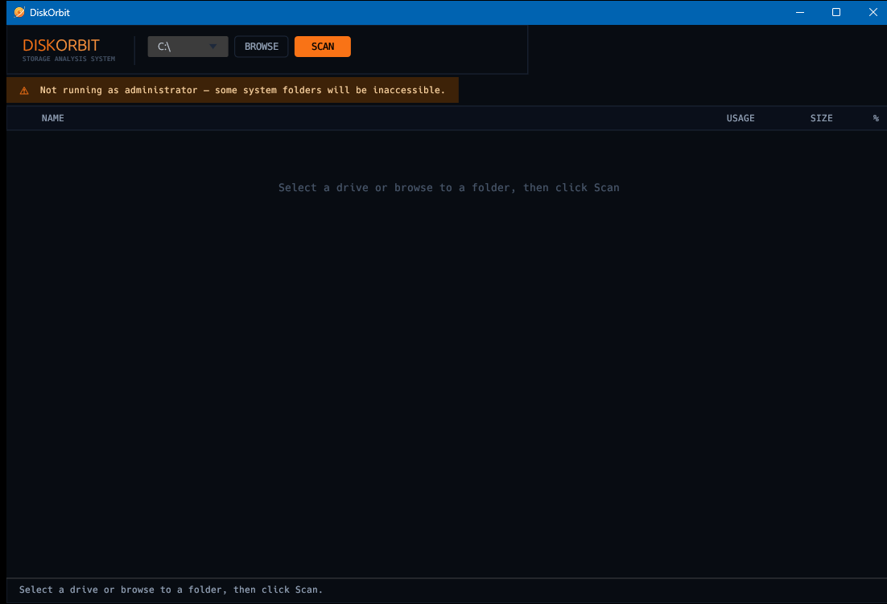

# DiskOrbit

[](https://github.com/Vallaqan/diskorbit/actions/workflows/ci.yml)
[](LICENSE)

**DiskOrbit** is a fast, single-binary disk space analyzer with a dark orbital-themed GUI. Select a drive, hit Scan, and explore your file system as a sortable tree with inline usage bars — no installer, no setup.


<!-- Replace with an actual screenshot -->

---

## Features

- **Parallel scanning** — Rayon-powered multi-threaded scan for large drives
- **Interactive tree view** — Expand/collapse folders, sorted largest-first
- **Visual usage bars** — Per-entry percentage bars at a glance
- **Drive selector** — Switch drives without restarting
- **Live progress** — Real-time status updates while scanning
- **Cancellable** — Stop a scan mid-flight without hanging
- **Context menu** — Right-click any entry to open in Explorer or copy its path
- **Admin detection** — Warns when system folders may be inaccessible
- **Single binary** — No runtime dependencies or installer required

## Download

Pre-built binaries for every tagged release are available on the [Releases](https://github.com/Vallaqan/diskorbit/releases) page:

| Platform | File |
|---|---|
| Windows x86-64 | `diskorbit-windows-x86_64.exe` |
| macOS Universal | `diskorbit-macos-universal` |
| Linux x86-64 | `diskorbit-linux-x86_64` |

**Windows:** Double-click the `.exe`. For full access to system folders, right-click → *Run as administrator*.

**macOS / Linux:**
```sh
chmod +x diskorbit-*
./diskorbit-*
```

> **Platform note:** DiskOrbit is primarily developed and tested on Windows. macOS and Linux builds compile and scan correctly, but drive selection, disk-usage statistics, and "Open in Explorer" are currently Windows-only.

## Building from Source

**Prerequisites:** [Rust toolchain](https://rustup.rs) (1.76+)

```sh
git clone https://github.com/Vallaqan/diskorbit.git
cd diskorbit

# Debug build
cargo build

# Optimized release build
cargo build --release

# Run directly
cargo run --release
```

The release binary lands at `target/release/diskorbit` (or `diskorbit.exe` on Windows).

### Linux build dependencies

```sh
sudo apt-get install -y \
  libxkbcommon-dev libxcb-shape0-dev libxcb-xfixes0-dev \
  libx11-dev libgl1-mesa-dev libfontconfig1-dev
```

## Development

This project uses [Just](https://github.com/casey/just) to document common tasks:

```sh
just          # list all tasks
just check    # fmt check + clippy + tests (mirrors CI)
just run      # cargo run (debug)
just test     # cargo test
just clippy   # cargo clippy -D warnings
just lint     # cargo fmt --check
just fmt      # cargo fmt (apply formatting)
just release  # cargo build --release
just clean    # cargo clean
```

## Repository description (suggested)

> Fast disk space analyzer for Windows with an orbital dark-themed GUI — single binary, parallel scanning, interactive tree view.

**Suggested tags:** `rust` · `disk-space` · `storage-analyzer` · `egui` · `gui` · `windows` · `filesystem` · `disk-usage`

## License

[MIT](LICENSE) © DiskOrbit Contributors
